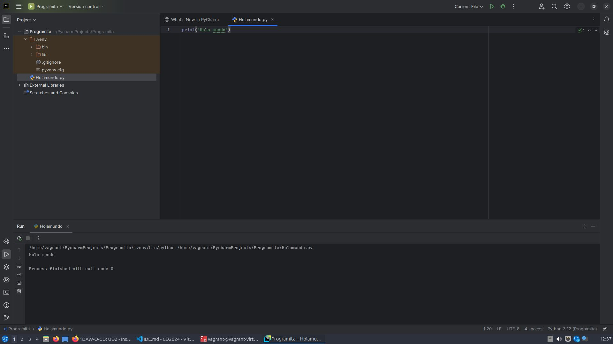

# Instalación de un IDE en Linux

- ## Razones para seleccionar un IDE concreto

    Existen distintos motivos:
    - Herramientas de desarrollo integradas.
    - Editor de código inteligente.
    - Asistente de inteligencia artificial.
    - Rápida navegación y búsqueda.

- ## Proceso de instalación

    Para la versión gratuita:
    1. Abrir terminal.
    1. Introducir el siguiente comando: sudo snap install pycharm-community --classic

    En caso de la versión de pago:
    1. Abrir terminal.
    1. Introducir el siguiente comando: sudo snap install pycharm-professional --classic

- ## Programa sencillo 

    Programa que imprime Hola mundo en el terminal:

    